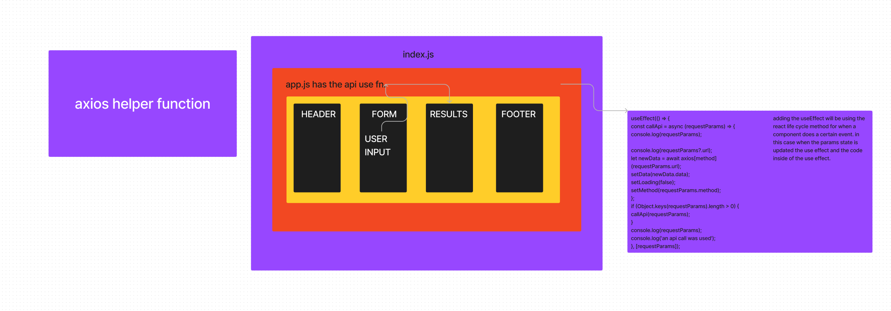

# LAB - Class 28

## Project:useEffect

### Author: Elias Staehle

### Problem Domain

Implement the useEffect in the application for the api call

### Links and Resources

- [tests](https://github.com/EDStaehle/resty/actions)
- [prod development](https://roaring-bonbon-c90036.netlify.app/)

### Setup

#### How to initialize/run your application (where applicable)

- visit the netlify link. if you decide to download this code and run it locally the start will be NPM start.

#### Features / Routes

using an api link input that into the input form and press submit when you do the results will render onto the page using the api call. The results will be modified using a prettier JSON formatter.

#### Tests

tests that the results will return the correct data.
tests that the form will work properly.

#### UML

